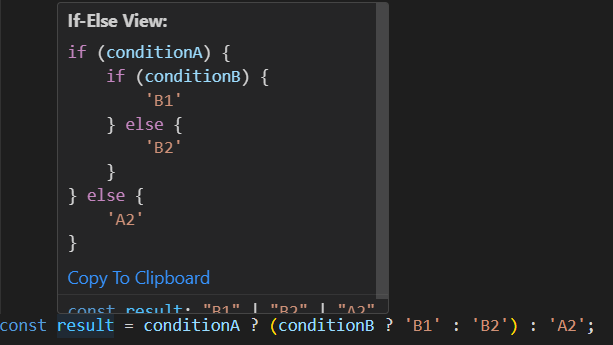
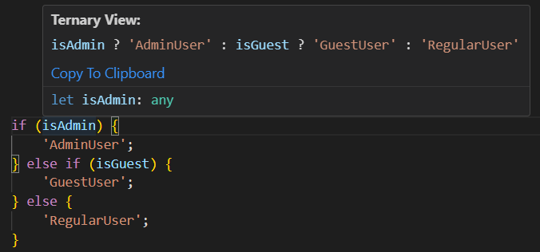

# Code Converter

A powerful tool that enables bidirectional visualization and conversion between `ternary expressions` and `if-else` statements.

## Table of Contents

- [Features](#features)
- [If-Else to Ternary](#if-else-to-ternary)
- [Ternary to If-Else](#ternary-to-if-else)
- [Additional Features](#additional-features)
- [How to Use](#how-to-use)
- [Ternary to If-Else](#ternary-to-if-else-1)
- [If-Else to Ternary](#if-else-to-ternary-1)
- [Supported Languages](#supported-languages)
- [Debugging](#debugging)
- [Common Issues](#common-issues)
    - [1. Unsupported File Types](#1-unsupported-file-types)
    - [2. Invalid Syntax](#2-invalid-syntax)
    - [3. Complex Nested Structures](#3-complex-nested-structures)
- [More Examples To Try With](#more-examples-to-try-with)
- [License](#license)

## Features:

### If-Else to Ternary

- **Description**: Transform nested `if-else` statements into concise ternary expressions.
- **Key Benefits**:
  - Faster execution compared to traditional if-else blocks.
  - Reduces code length without losing functionality.
  - Embraces modern JavaScript practices.
  - Optimizes memory usage and final bundle size in production.

### Ternary to If-Else

- **Description**: Convert ternary expressions into more readable `if-else` statements.
- **Key Benefits**:
  - Simplifies debugging and understanding of complex logic.
  - Serves as a learning aid for new team members.
  - Useful for teaching fundamental programming concepts.

### Additional Features:
- **Copy & Paste**: Easy to copy the converted code and modify it for your needs
- **Instant Preview**: See conversions in real-time without affecting original code
- **Bidirectional Conversion**: Freedom to switch between both formats as needed

## How to Use:

### Ternary to If-Else:
1. **Hover Over Ternary Expressions**: Simply hover your mouse over any ternary condition (`condition ? value1 : value2`).
2. **View Conversion**: The extension will automatically show the corresponding `if-else` statement as a hover preview.
   - Example:

     ```javascript
     const result = condition ? 'yes' : 'no';
     ```
     Will be converted to:

     ```javascript
     if (condition) {
         'yes';
     } else {
         'no';
     }
     ```
3. **Preview Exapmle**
  - If-else" style="width: 100%; height: auto;">

### If-Else to Ternary:
1. **Select If-Else Block**: Highlight the if-else statement you want to convert.
2. **Convert to Ternary**: The extension will transform it into an equivalent ternary expression.
   - Example:

     ```javascript
     if (condition) {
         return valueA;
     } else {
         if (nestedCondition) {
             return valueB;
         } else {
             return valueC;
         }
     }
     ```
     Will be converted to:

     ```javascript
     condition ? valueA : (nestedCondition ? valueB : valueC)
     ```
3. **Preview Exapmle**
  - If-else" style="width: 100%; height: auto;">

## Supported Languages:

This extension supports the following languages:
- JavaScript (`.js`)
- TypeScript (`.ts`)
- JavaScript React (`.jsx`)
- TypeScript React (`.tsx`)

## Debugging:

### Common Issues:

#### 1. Unsupported File Types
- Verify that you're using one of the supported file extensions:
    - JavaScript (.js)
    - TypeScript (.ts)
    - JavaScript React (.jsx)
    - TypeScript React (.tsx)

#### 2. Invalid Syntax
- Code must be syntactically correct for the converter to work
- Use your IDE's linting tools to check for syntax errors

#### 3. Complex Nested Structures
- While both converters support nested structures, extremely complex cases might need to be broken down
- Consider splitting very complex conditions into smaller, more manageable parts

## More Examples To Try With:

- [Nested Ternary to If-Else:](#nested-ternary-to-if-else)
- [Ternary in Functions:](#ternary-in-functions)
- [JSX Ternary Expression:](#jsx-ternary-expression)
- [Objects:](#objects)
- [Nested If-Else to Ternary:](#nested-if-else-to-ternary)

### Nested Ternary to If-Else:
```javascript
const value = conditionA ? (conditionB ? 'B1' : 'B2') : 'A2';
```
Converts to:
```javascript
if (conditionA) {
    if (conditionB) {
        'B1';
    } else {
        'B2';
    }
} else {
    'A2';
}
```

### Ternary in Functions:
```javascript
function getStatus(conditionA: any) {
    return conditionA
        ? 100 + 50
        : Math.random() > 0.5
            ? 'Random True'
            : 'Random False';
}
```
Converts to:
```javascript
if (conditionA) {
    100 + 50
} else {
    if (Math.random() > 0.5) {
        'Random True'
    } else {
        'Random False'
    }
}
```

### JSX Ternary Expression:
```javascript
{posts?.length > 0 ? (
posts.map((post) => (
    <StartupCard key={post?._id} post={post as StartupTypeCard} />
))
) : (
<p className="no-results">No Startups Found</p>
)}
```
Converts to:
```javascript
if (posts?.length > 0) {
    posts.map(post => <StartupCard key={post?._id} post={post as StartupTypeCard} />)
} else {
    <p className="no-results">No Startups Found</p>
}
```

### Objects:
```javascript
const obj2 = {
    key: conditionA ? (conditionB ? 'value1' : 'value2') : 'value3',
}
```
Converts to:
```javascript
if (conditionA) {
    if (conditionB) {
        'value1'
    } else {
        'value2'
    }
} else {
    'value3'
}
```

### Nested If-Else to Ternary:
```javascript
if (hardCustomOccupancy && roomCustomOccupancy) {
    roomCustomOccupancy?.adult;
} else {
    if (setSelectionDetails) {
        if (condition) {
            valueA;
        } else {
            valueB;
        }
    } else {
        valueC;
    }
}
```
Converts to:
```javascript
hardCustomOccupancy && roomCustomOccupancy 
    ? roomCustomOccupancy?.adult 
    : setSelectionDetails 
        ? condition ? valueA : valueB 
        : valueC
```

## License:

This project is licensed under the MIT License - see the [LICENSE](./LICENSE) file for details.