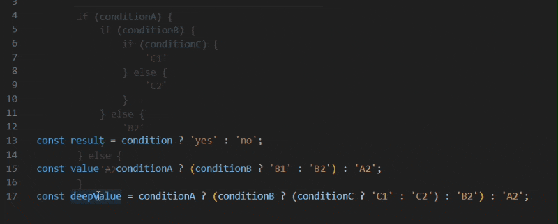

# Ternary to If-Else

- Easily convert ternary expressions into readable `if-else` statements.
- Supports both simple and nested ternary conditions.
- Makes code more intuitive and easier to debug.
- View the `if-else` conversion instantly by hovering over the ternary.
- Enhances readability for better collaboration and understanding.

## Preivew:



## Features:

- **Hover to Convert**: Instantly see ternary expressions as `if-else`.
- **Handles Nested Ternaries**: Breaks down complex conditions.
- **Multi-Language Support**: Works with `.js`, `.ts`, `.jsx`, `.tsx`.
- **Improves Readability**: Simplifies complex logic for better understanding.

## How to Use:

1. **Hover Over Ternary Expressions**: Simply hover your mouse over any ternary condition (`condition ? value1 : value2`).
2. **View Conversion**: The extension will automatically show the corresponding `if-else` statement as a hover preview.
   - Example:

     ```javascript
     const result = condition ? 'yes' : 'no';
     ```
     Will be converted to:

     ```javascript
     if (condition) {
         'yes';
     } else {
         'no';
     }
     ```

3. **Nested Ternaries**: Nested ternary conditions are automatically expanded into a readable structure.
   - Example:

     ```javascript
     const value = conditionA ? (conditionB ? 'B1' : 'B2') : 'A2';
     ```
     Will be converted to:

     ```javascript
     if (conditionA) {
         if (conditionB) {
             'B1';
         } else {
             'B2';
         }
     } else {
         'A2';
     }
     ```

## Supported Languages:

This extension supports the following languages:

- JavaScript (`.js`)
- TypeScript (`.ts`)
- JavaScript React (`.jsx`)
- TypeScript React (`.tsx`)

## Debugging:

If the extension doesn't seem to work as expected, here are a few common issues to check:

#### 1. Missing Semicolon

- The extension relies on correctly formatted code, including proper semicolons.
- If you encounter an error or the hover preview doesn't show, ensure that the ternary expression ends with a semicolon (`;`).
- Example of a missing semicolon issue:
  ```javascript
  const value = conditionA ? 'A1' : 'A2'
  ```

#### 2. Unsupported File Types

- Ensure the file type is one of the supported languages:
    - JavaScript (.js)
    - TypeScript (.ts)
    - JavaScript React (.jsx)
    - TypeScript React (.tsx)

#### 3. Invalid Syntax

- If your code contains syntax errors, the extension won't be able to parse and convert the ternary expression.
- Use your IDE's linting or formatting tools to ensure there are no issues.

#### 4. Nested or Complex Structures

- While the extension supports nested ternary expressions, extremely complex structures may not be handled perfectly. Try simplifying the expression or breaking it into smaller parts.


## License:

This project is licensed under the MIT License - see the [LICENSE](./LICENSE) file for details.